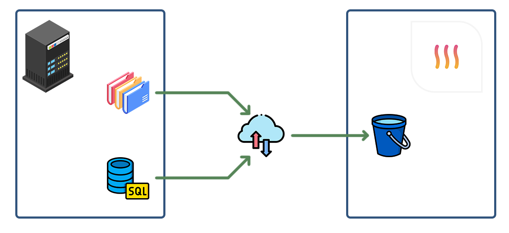
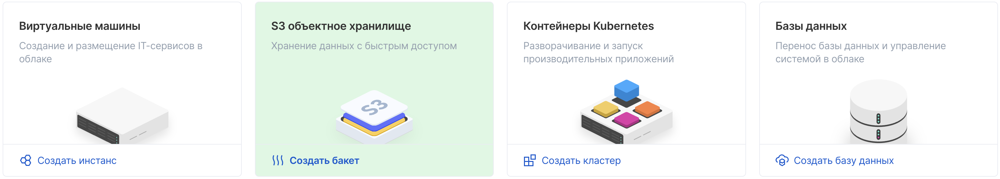
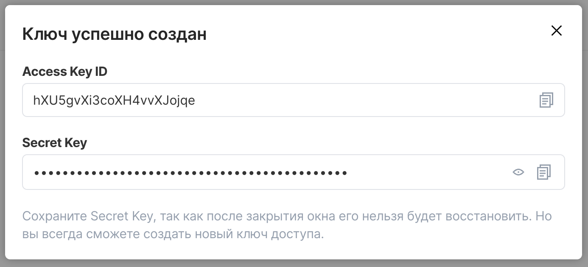

# Бекап данных с серверов в хранилище S3



В данной инструкции описан полный цикл для создания автоматических резервных копий в S3, с использованием платформы VK Cloud Solutions (MCS) (при должной сноровке и умении эти знания можно переложить на любое совместимое с S3 хранилище). Данная платформа выбрана по нескольким объективным для меня причинам:

- относительно демократичные цены;
- простота настройки политик доступа (в отличие от AWS – больше года туда бекапил, после аренды нового сервера каждый раз вспоминал всё снова);
- высокая скорость аплоада;
- высокая доступность;
- отдельные ключи на каждый бакет.

Я считаю, что бекапить можно куда угодно (необязательно в S3), главное сам факт наличия резервных копий. Но работать с S3 удобнее :)

В самом начале стоит сказать, что для использования S3 **не нужно** создавать внутри платформы никакие сервера, т.к. хранилище S3 предоставляется в виде услуги, которой можно пользоваться без создания промежуточных VPS.

## Содержание

* [Действия на платформе VK Cloud Solutions](#действия-на-платформе-vk-cloud-solutions)
    * [Основные термины и понятия](#основные-термины-и-понятия)
    * [Расчёт стоимости](#расчёт-стоимости)
    * [Пример расчёта](#пример-расчёта)
    * [Начало работы](#начало-работы)
    * [Создание бакета](#создание-бакета)
    * [Создание ключа доступа](#создание-ключа-доступа)
* [Действия на сервере](#действия-на-сервере)
    * [Установка aws-cli](#установка-aws-cli)
    * [Настройка доступа к бакету](#настройка-доступа-к-бакету)
    * [Эндпоинты](#эндпоинты)
    * [Резервное копирование директорий в S3](#резервное-копирование-директорий-в-s3)
    * [Резервное копирование MySQL в S3](#резервное-копирование-mysql-в-s3)
    * [Резервное копирование PostgreSQL в S3](#резервное-копирование-postgresql-в-s3)
    * [Восстановление из бекапа](#восстановление-из-бекапа)
    * [Разное](#разное)
* [Автор](#автор)

## Действия на платформе VK Cloud Solutions

### Основные термины и понятия

**S3** – облачное хранилище для загрузки в него любых файлов с возможностью доступа к ним в любое время.

**Бакет** – (_пер.: ведро_) сущность внутри S3, что-то вроде отдельного диска, куда загружаются папки и файлы. Существуют несколько типов бакетов, различающиеся в цене.

**Тип бакета: Горячие данные (Hotbox)** – подходит для хранения бекапов и других данных, которые могут часто заливаться и скачиваться.

**Тип бакета: Холодные данные (Icebox)** – подходит для хранения логов и других крайне редко используемых данных, которые необходимо просто хранить и почти не скачивать. Тарификация исходящего трафика (скачивание из S3) у этого типа бакета дороже чем у Hotbox.

**Ключи** – пара уникальных значений (_Access Key ID_ и _Secret Key_), с помощью которых осуществляется доступ к бакету с сервера. Необходимо хранить их в секрете!

**ACL** – расширенное управление доступом к ресурсу (бакету). Нам (к счастью) не пригодится.

### Расчёт стоимости

Для подсчёта стоимости хранения резервных копий можно воспользоваться [калькулятором](https://mcs.mail.ru/pricing/), выбрав услугу «Объектное хранилище» (Cloud Storage). Стоит отдельно обратить внимание, что почему-то в калькуляторе не отображены поля для ввода количества запросов и объема исходящего трафика, но они указаны на [странице тарифов](https://mcs.mail.ru/docs/ru/base/s3/rates-and-limits/s3-rates).

Я советую выбирать тип хранилища "Горячие данные", потому что разница в стоимости хранения незначительная, а вот стоимость скачивания из S3 для хранилища с "Холодными данными" – выше. Это может привести к большим затратам, в случае если вам нужно будет восстановить данные из копии.

Также, на своём опыте могу сказать что для бэкапов можно пренебречь стоимостью "запросов" (из тарифов), потому что суммарно они будут сильно ниже чем само хранение данных.

Если вы планируете загружать большие файлы (более 32ГБ), то из-за лимитов платформы их необходимо разбивать на части.

К сожалению, с 1‑го апреля планируется повышение цен (на момент публикации данной статьи новые цены ещё не отражены в калькуляторе и тарифах). Ознакомиться с новой стоимостью можно [по ссылке](https://mcs.mail.ru/pricelist). Как мне кажется, повышение – незначительное, и цены всё ещё выглядят адекватно.

#### Пример расчёта

Например, планируется ежедневно заливать новые бэкапы и хранить данные за последние 2 дня (в сумме 200 ГБ) в хранилище «Hotbox» (горячие данные). Пример расчёта на месяц (по новым ценам):

- _Объем данных (хранение)_: 200 ГБ * 2.1 ₽ = 420 ₽
- _Загрузка, входящий трафик_: бесплатно
- _Скачивание, исходящий трафик_: 100 ГБ (например, если 1 раз в месяц надо восстановиться) * 1.2 ₽ = 120 ₽
- _Запросы 1-го типа (PUT, META, LIST)_: 25 (тысячи, примерное значение) * 0.295 ₽ (за 1000 запросов) = 7.37 ₽
- _Запросы 2-го типа (GET и др.)_: 2 (тысячи, примерно) * 0.295 ₽ (за 1000 запросов) = 0.59 ₽
- _Запросы DELETE_: бесплатно

**Итого:** 547.96 ₽ в месяц

Аналогичный расчёт для хранилища «Icebox» (холодные данные):

- _Объем данных (хранение)_: 200 ГБ * 1.92 ₽ = 384 ₽
- _Загрузка, входящий трафик_: бесплатно
- _Скачивание, исходящий трафик_: 100 ГБ (например, если 1 раз в месяц надо восстановиться) * 1.92 ₽ = 192 ₽
- _Запросы 1-го типа (PUT, META, LIST)_: 25 (тысячи, примерное значение) * 0.295 ₽ (за 1000 запросов) = 7.37 ₽
- _Запросы 2-го типа (GET и др.)_: 2 (тысячи, примерно) * 0.59 ₽ (за 1000 запросов) = 1.18 ₽
- _Запросы DELETE_: бесплатно

**Итого:** 584.55 ₽ в месяц

Как видите, если раз в месяц нужно скачать данные из хранилища – выгоды от использования Icebox нет. Конечно, если это будет происходить не каждый месяц, а раз в год, то некая экономия всё же получится.

Перед созданием бакета стоит взвесить все "за" и "против" при выборе его типа. Хоть на MCS и можно поменять тип бакета после его создания, но на других S3-совместимых хранилищах такая функциональность доступна не всегда.

### Начало работы

Необходимо зарегистрироваться на [https://mcs.mail.ru/](https://mcs.mail.ru/), верифицировать аккаунт и добавить карту (спишется 500 рублей на баланс). После этого будет создан проект по умолчанию, внутри которого можно создавать новые бакеты.

Стоит заметить, что если создавать новые проекты, то нужно будет к каждому из них заново привязывать карту, потому что биллинг для каждого из проектов – отдельный. Поэтому просто удобнее пользоваться одним дефолтным проектом и располагать всё внутри него.

### Создание бакета

Для создания бакета необходимо перейти на [главную страницу платформы](https://mcs.mail.ru/app) и выбрать в боковом меню пункт «Объектное хранилище -> Бакеты» или перейти по выделенной на скрине ссылке:



После этого перед вами откроется список бакетов, где вверху есть кнопка добавления нового бакета – необходимо клацнуть по ней. После этого откроется попап, где необходимо ввести:

- **Название бакета** – уникальное название на латинском (с использованием цифр, символа тире, подчёркивания и точки).
- **Класс хранения** – тип хранилища: Hotbox или Icebox.
- **Настройка ACL по умолчанию** – всегда выбирайте «private», чтобы ни у кого кроме вас не было доступа к бакету. Случай, когда необходимо предоставить доступ всему Интернету – умышленно не рассматривается :)

После этого созданный бакет отобразится в списке.

### Создание ключа доступа

Нужно открыть созданный бакет, перейти на вкладку «Ключи» и создать новую пару ключей (название ключа – должно быть уникальным). Для наших целей _не нужно_ включать галочку "Ограничить доступ" и прописывать префикс, потому что это ограничения на уровне директорий внутри бакета, которые для текущей задачи не нужны.



После создания ключа отобразятся **Access Key ID** и **Secret Key**, необходимо их записать (будем использовать далее) и хранить в секрете, потому что с ними можно выполнять любые действия с файлами внутри бакета. В случае утери – всегда можно удалить ключ и создать новый.

На платформе MCS (VK Cloud Solutions) очень удобно реализовано создание ключей: они привязываются к бакету и не имеют доступа к другим бакетам, в отличие от AWS S3 – там нужно пройти несколько кругов ада, чтобы настроить политики доступа созданных ключей, и есть огромный риск выдать ключу чуть больше привилегий чем это необходимо.

Если вы будете использовать любое другое S3-совместимое хранилище, то я настоятельно рекомендую создавать для каждого сервера свой бакет и ключи, чтобы не бекапить всё в одну кучу. Почему? Всё очень просто: в случае компрометации одного сервера – не будет доступа к данным в S3 с других серверов.

## Действия на сервере

А теперь самое время перейти к технической части :)

### Установка aws-cli

Подключитесь к серверу, откуда планируется делать бекапы по SSH от привилегированного пользователя (`root`) и выполните следующие команды (пример для операционной системы Ubuntu, для других ОС команды могут немного отличаться):

```bash
# Устанавливаем зависимости
apt install -y curl unzip

# Скачиваем архив
curl "https://awscli.amazonaws.com/awscli-exe-linux-x86_64.zip" -o "awscliv2.zip"

# Распаковываем архив
unzip awscliv2.zip

# Запускаем установщик
./aws/install

# Проверяем что всё работает (в результате должна отобразиться версия)
/usr/local/bin/aws --version
```

В случае возникновения каких-либо ошибок – смотрите [официальную документацию](https://docs.aws.amazon.com/cli/latest/userguide/getting-started-install.html) или [страницу помощи на mcs](https://mcs.mail.ru/docs/ru/base/s3/tools/s3-cli).

### Настройка доступа к бакету

_Стоит осознать тонкую грань_: если вы планируете запускать скрипт для создания резервных копий от какого-то другого пользователя в системе (не от `root`), то выполнять следующие команды нужно переключившись на него.

Необходимо прописать ключи, которые были получены в разделе «Создание ключа доступа» чтобы у сервера был доступ к бакету. Делается это следующим способом:

```bash
# Создаем директорию, в которой будет храниться файл с ключами
mkdir -p ~/.aws

# Записываем ключи в файл
echo "[default]
aws_access_key_id = Access_Key_ID
aws_secret_access_key = Secret_Key
" > ~/.aws/credentials
```

Вместо `Access_Key_ID` и `Secret_Key` необходимо подставить полученные ранее значения.

Замечу, что иногда для других S3 хранилищ стоит также прописать регион (директива `region` в файле с ключами), в котором создан бакет, но в нашем примере в этом нет необходимости.

### Эндпоинты

По умолчанию `aws-cli` настроена на работу с AWS S3, и чтобы начать использовать её с другими платформами – необходимо настроить endpoint URL. К сожалению, [уже много лет](https://github.com/aws/aws-cli/issues/1270) разработчики этой утилиты не добавляют эндпоинты в конфигурацию, поэтому придется использовать алиасы или писать эндпоинт аргументом к каждой команде.

Для каждого из типов хранилищ необходимо использовать собственный endpoint:

Тип хранилища | Endpoint URL
--------------|-------------
Горячие данные (Hotbox) | https://hb.bizmrg.com/
Холодные данные (Icebox) | https://ib.bizmrg.com/

Он прописывается в аргументе `--endpoint-url`, пример:

```bash
# Получить список файлов в корневой директории бакета
/usr/local/bin/aws s3 ls s3://BUCKET_NAME/ --endpoint-url=https://hb.bizmrg.com
```

### Резервное копирование директорий в S3

Вот мы и достигли самой важной части, ради которой всё затевалось :)

Для бэкапа файлов/директории с файлами необходимо использовать следующий скрипт (создайте его у себя на сервере в файле с расширением `.sh`, например: `backup_dir.sh`):

```bash
#!/bin/bash
set -euo pipefail

### Настройки

# Имя бакета, куда будут заливаться бекапы
S3_BUCKET='my-backup-bucket'

# Endpoint URL (в примере: Hotbox, горячие данные)
S3_ENDPOINT='https://hb.bizmrg.com'

# Путь к директории, которую необходимо бекапить
BACKUP_DIR='/path/to/important_dir'

# Путь к директории где будут создаваться архивы.
# Эта папка будет синхронизироваться с S3,
# поэтому при удалении там файлов - они пропадут и в хранилище.
# Путь должен быть БЕЗ слеша на конце!
SYNC_DIR='/backups/dir1'

# Префикс создаваемых архивов
ARCHIVE_PREFIX='data'

### Основной код

# Время создания бэкапа
DATE="$(date +%Y-%m-%d_%H-%M)"

# Создаем директорию для синхронизации, если она ещё не существует
mkdir -p "${SYNC_DIR}"

# Удаляем все архивы из директории для синхронизции, дата изменения которых больше 7 дней
find "${SYNC_DIR}/${ARCHIVE_PREFIX}*" -mtime +7 -exec rm {} \;

# Создаем архив из директориии для бекапа в папке для синхронизации
tar -czf "${SYNC_DIR}/${ARCHIVE_PREFIX}_${DATE}.tar.gz" "${BACKUP_DIR}"

# Синхронизируем папку с S3 хранилищем.
# Стоит обратить внимание на аргумент `--delete` – он означает,
# что если в исходной директории (SYNC_DIR) нет файла, который есть в S3,
# то он удалится в хранилище.
/usr/local/bin/aws s3 sync --delete "${SYNC_DIR}" "s3://${S3_BUCKET}" --endpoint-url="${S3_ENDPOINT}"
```

После создания данного файла на сервере (с изменением настроек) для удобства можно задать ему права на выполнение:

```bash
chmod +x backup_dir.sh
```

Для начала – советую попробовать запустить этот скрипт из консоли самостоятельно, чтобы проверить, что всё работает корректно (нужно запустить **одну** из команд):

```bash
# если дали права на выполнение
./backup_dir.sh

# ИЛИ если прав не давали
bash backup_dir.sh
```

Если возникнут какие-либо ошибки, то скрипт сообщит об этом. Если ошибок нет, то нужно зайти в бакет на платформе и проверить что архив успешно залился (для спокойствия можно даже скачать этот архив и проверить что его содержимое соответствует вашим ожиданиям).

Если всё ок, то нужно добавить этот файл в crontab для запуска по расписанию. Не стоит забывать прописывать полный путь к файлу, а также помнить, что его необходимо добавлять в cron для того пользователя, в котором вы ранее прописывали ключи.

### Резервное копирование MySQL в S3

В данном примере рассмотрено создание бекапов баз данных MySQL с помощью дампа, что в целом неправильно (потому что для нормальных бекапов БД нужно инкрементальное резервное копирование, да и на него будет тратиться меньше ресурсов). Но если у вас данные в базе меняются редко, то можно использовать и такой способ. В ином случае – стоит использовать утилиты вроде [wal-g](https://github.com/wal-g/wal-g/blob/master/docs/MySQL.md).

Скрипт очень похож на предыдущий (необходимо положить его в файл с расширением `.sh`, например: `backup_db.sh`):

```bash
#!/bin/bash
set -euo pipefail

### Настройки

# Имя бакета, куда будут заливаться бекапы
S3_BUCKET='my-backup-db-bucket'

# Endpoint URL (в примере: Hotbox, горячие данные)
S3_ENDPOINT='https://hb.bizmrg.com'

# Пользователь в БД, от которого запускается mysqldump
MYSQL_USER='root'

# Пароль для пользователя
MYSQL_PWD='passw0rd'

# База данных, которую необходимо сдампить
MYSQL_DB='cooldb'

# Путь к директории где будут создаваться архивы.
# Эта папка будет синхронизироваться с S3,
# поэтому при удалении там файлов - они пропадут и в хранилище.
# Путь должен быть БЕЗ слеша на конце!
SYNC_DIR='/backups/mysql'

# Префикс создаваемых архивов
ARCHIVE_PREFIX='db'

### Основной код

# Время создания бэкапа
DATE="$(date +%Y-%m-%d_%H-%M)"

# Создаем директорию для синхронизации, если она ещё не существует
mkdir -p "${SYNC_DIR}"

# Удаляем все архивы из директории для синхронизции, дата изменения которых больше 7 дней
find "${SYNC_DIR}/${ARCHIVE_PREFIX}*" -mtime +7 -exec rm {} \;

# Удаляем директорию с дампами (если в предыдущий запуск что-то пошло не так)
# и создаем её заново
rm -rf "${SYNC_DIR}/_current"
mkdir -p "${SYNC_DIR}/_current"

# Дампим вначале схему БД
mysqldump -u "${MYSQL_USER}" -p${MYSQL_PWD} --quote-names --create-options --force --no-data --databases "${MYSQL_DB}" > "${SYNC_DIR}/_current/dump.sql"

# А потом туда же дозаливаем данные
mysqldump -u "${MYSQL_USER}" -p${MYSQL_PWD} --quote-names --no-create-info  --force --databases "${MYSQL_DB}" >> "${SYNC_DIR}/_current/dump.sql"

# Если нужно, то в предыдущие 2 команды можно добавить другие опции:
# https://dev.mysql.com/doc/refman/8.0/en/mysqldump.html

# Создаем архив из дампа в папке для синхронизации
tar -czf "${SYNC_DIR}/${ARCHIVE_PREFIX}_${DATE}.tar.gz" "${SYNC_DIR}/_current"

# Удаляем директорию с дампом
rm -rf "${SYNC_DIR}/_current"

# Синхронизируем папку с S3 хранилищем.
# Стоит обратить внимание на аргумент `--delete` – он означает,
# что если в исходной директории (SYNC_DIR) нет файла, который есть в S3,
# то он удалится в хранилище.
/usr/local/bin/aws s3 sync --delete "${SYNC_DIR}" "s3://${S3_BUCKET}" --endpoint-url="${S3_ENDPOINT}"
```

Далее по аналогии с предыдущим разделом: докидываем права на выполнение, проверяем вручную и если всё хорошо, то добавляем в cron.

### Резервное копирование PostgreSQL в S3

Советую использовать инструкцию из статьи, которую я написал почти 2 года назад: [WAL-G: бэкапы и восстановление СУБД PostgreSQL](https://habr.com/ru/post/506610/). В ней рассказано о способе резервного копирования, который крутится у меня в продакшене всё это время и ни разу не подвёл. Конечно, можно использовать и `pg_dump`/`pg_dumpall`, но только в том случае, если данные в БД меняются редко и вы не боитесь потерять какой-то кусок из них :)

Единственное замечание к той статье, которое необходимо добавить: в конфигурационный файл `/var/lib/postgresql/.walg.json` нужно будет прописать эндпоинт для работы с MCS:

```
    "AWS_ENDPOINT": "https://hb.bizmrg.com",
```

### Восстановление из бекапа

Тут всё просто: выбираете нужный архив (например, зайдя в интерфейсе VK Cloud Solutions в бакет) и выполняете следующие команды на сервере:

```bash
# Скачиваете файл с именем data_2022-01-01_00-00.tar.gz
/usr/local/bin/aws s3 cp s3://BUCKET-NAME/data_2022-01-01_00-00.tar.gz /path/to/save/ --endpoint-url=https://hb.bizmrg.com

# Разархивируте его
tar -xzf /path/to/save/data_2022-01-01_00-00.tar.gz

# И уже дальше самостоятельно перемещаете полученные папки куда нужно или запускаете mysql с дампом :)
```

### Разное

1. Просмотр списка файлов в корневой директории бакета:

```bash
/usr/local/bin/aws s3 ls s3://BUCKET_NAME/ --endpoint-url=https://hb.bizmrg.com
```

2. Отправка большого архива без сохранения копии на диске:

```bash
tar -cv huge_file.log | /usr/local/bin/aws s3 cp - s3://BUCKET_NAME/archive_name.tar.gz --endpoint-url=https://hb.bizmrg.com
```

3. Удаление файла из хранилища:

```bash
/usr/local/bin/aws s3 rm s3://BUCKET_NAME/filename.tar.gz --endpoint-url http://hb.bizmrg.com
```

## Автор

Lord_Alfred

Блог: [https://t.me/lord_Alfred](https://t.me/lord_Alfred)
